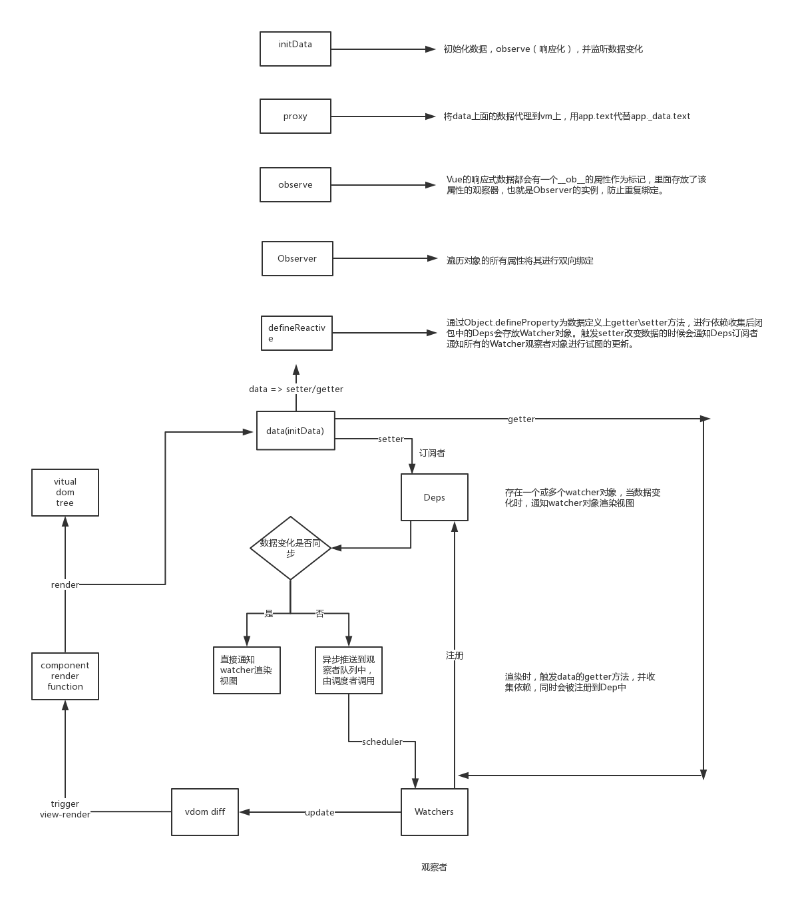

### Vue源码精读



1. [Vue.extend](#1)
2. [Vue生命周期顺序](#2)
3. [Vue数据响应原理](#3)
4. [依赖收集的意义](#4)


#### <a name="1">1. Vue.extend</a>
----

  基础 Vue 构造器，可以创建一个“子类”。

  * `extend`函数（213行）：将所有属性混合至目标对象

  * `initExtend`函数（4355行）：构建Vue.extend函数并调用extend函数

  * `initGlobalAPI`函数（4593行）：构建Vue全局API，如extend/nextTick/set/delete/mixin等，并调用initExtend函数


#### <a name="2">2. Vue生命周期顺序</a>
----

  包含`keep-alive`动态组建被调用的情况，进入组件时的调用顺序：

  ```javascript
  // App.vue
  <template>
    <div id="app">
      <keep-alive><router-view></router-view></keep-alive>
    </div>
  </template>
  // Hello.vue
  <template></template>
  <script>
    export default {
      name: 'hello',
      data () {
        return {
          msg: 'Welcome to Your Vue.js App'
        }
      },
      created: function () {
        alert('实例已经创建')
      },
      beforeMount: function () {
        alert('实例挂载之前')
      },
      mounted: function () {
        alert('实例挂载到根元素 #app上')
      },
      beforeUpdate: function () {
        alert('数据更新之前')
      },
      updated: function () {
        alert('数据更新之后')
      },
      activated: function () {
        alert('keep-alive 组件激活时调用')
      },
      deactivated: function () {
        alert('keep-alive 组件停用时调用')
      },
      beforeDestroy: function () {
        alert('实例销毁之前调用')
      },
      destroyed: function () {
        alert('实例销毁之后调用')
      }
    }
    </script>
  ```
  * beforeCreated
  * created
  * beforeMount
  * Mounted
  * activated 此钩子函数是在mounted之后调用的


#### <a name="3">3. Vue响应原理</a>
----

主要是将data数据转为可观察的（或者成为数据绑定/响应化）

  * 在初始化vue实例时，initData将data通过observer进行可观察的转变

  * 使用代理模式，通过proxy使得组件代理到根级data对象

  * observer将调用defineReactive将data中的属性转化为getters/setters

  * getters中将此data属性作为依赖进行收集，setters中将会触发observer中传递进去的回调函数


#### <a name="4">4. 依赖收集的意义</a>
----

data中会存储很多数据，但是没有必要当其中一个数据发生改变，便将其它数据都重新渲染，应该仅仅重新渲染与发生改变的数据相关联的部分。

* Dep类

  当data中的数据被修改时，会触发相应的setter，当获取data中的数据时，就会触发相应的getter，因此在开始渲染时，渲染中所依赖的data数据就会通过getter进行收集到Dep中的subs(Watcher)中去，在修改data数据时，通过setter触发Dep中subs收集的回调函数。

* Watcher类

  将getter收集到的依赖存在watcher中，然后赋给全局的Dep.target(Dep.target/watcher全局唯一)，相关的回调函数将会绑定对应的vue实例，等待setter的notify，然后watcher就会执行对应的update方法，实现相应的回调函数的执行
